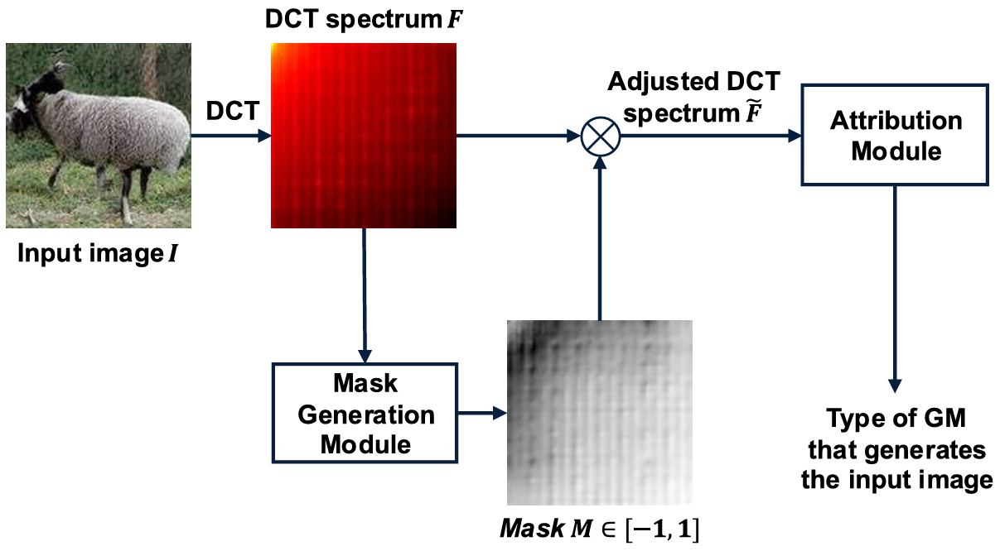

# An Efficient Frequency Domain Based Attribution and Detection Network for Synthesized Images

This is the repository for paper [An Efficient Frequency Domain Based Attribution and Detection Network for Synthesized Images](https://ieeexplore.ieee.org/abstract/document/10855423) accepted to IEEE Access.

## Checkpoints

Our trained models can be found [here](https://www.dropbox.com/scl/fi/zjj7mlziu3yrnremojf1b/ours_32.pth?rlkey=354sqn3a1e5w1qvou64xiu8e3&st=eshjg7ba&dl=0).